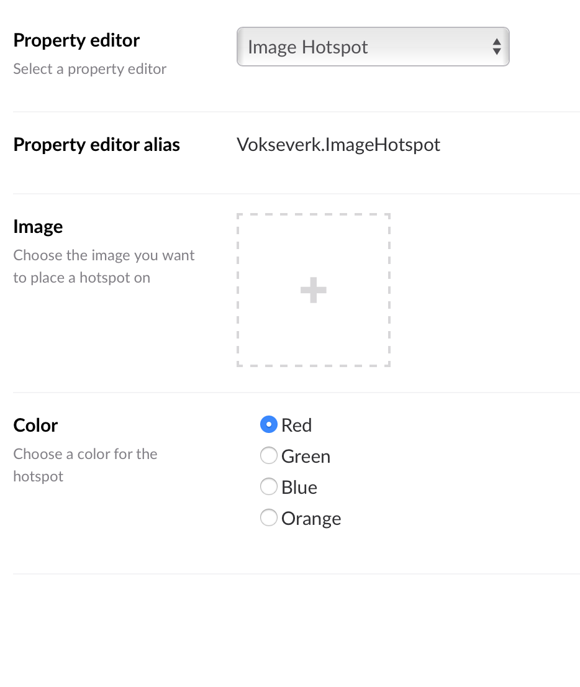
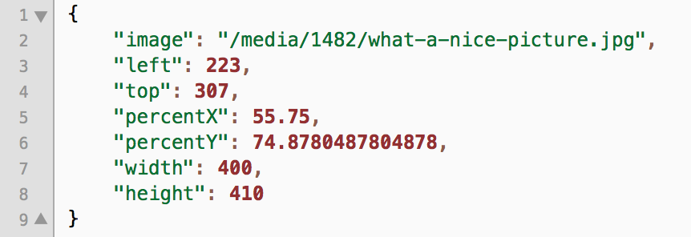

# Image Hotspot Property Editor for Umbraco 7

This is an attempt to provide similar functionality to what was previously available with the [uComponents ImagePoint](http://ucomponents.github.io/data-types/image-point/)
data type in Umbraco, versions 4 and 6.

This one's just called “Image Hotspot” because that's what our clients call it when they ask for this kind of thing :-)

_**PLEASE NOTE:** This may not at all be production ready for your particular use, but if you want to try it out there's
an Umbraco package available on the releases page._

## What does it look like?

Currently, it looks like this:

### Configuration:



*DataType Configuration*

***

### Property editor:


*Property editor with variant colors*

("Color" defines the color of the Hotspot - all colors shown above)

***

### Property Data

The raw JSON data looks like this:



*JSON Data*

The hotspot coordinate is saved both as exact pixel values and as percentage values,
along with the image's path and width & height.

There's a **PropertyConverter** you can grab and throw in your solution (or drop in the `App_Code` folder) here: [ImageHotspotPropertyConverter.cs](src/ImageHotspotPropertyConverter.cs),
or you can download it from the release page.

This enables ModelsBuilder to do its magic and provide you with an ImageHotspot object instead:

```csharp
public class ImageHotspot {
	public string Image { get; set; }
	public int Left { get; set; }
	public int Top { get; set; }
	public decimal PercentX { get; set; }
	public decimal PercentY { get; set; }
	public int Width { get; set; }
	public int Height { get; set; }
}
```	

***

## TODO

- [ ] Get `imageSrc` from a mediapicker value of some sorts (e.g. recursively look for `umbracoFile` as the uComponents data type did)
- [ ] Add configuration prevalue for the `width` used in the backoffice
- [x] Rename Theme config to Hotspot Color (or similar)
- [x] Add configuration prevalue for `theme`
- [x] Build script

## Credits

* LEGO image from [Louieland](http://reserve.louie.land/Wallpapers/LEGO/ "Index of /Wallpapers/LEGO")
