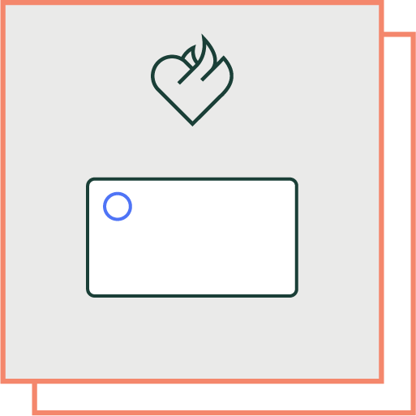
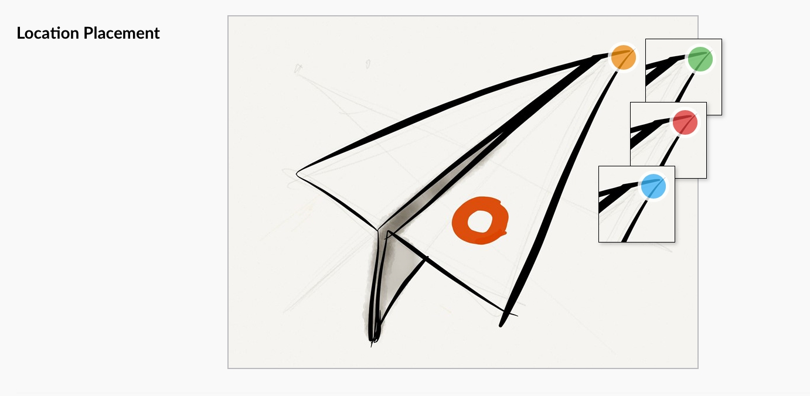
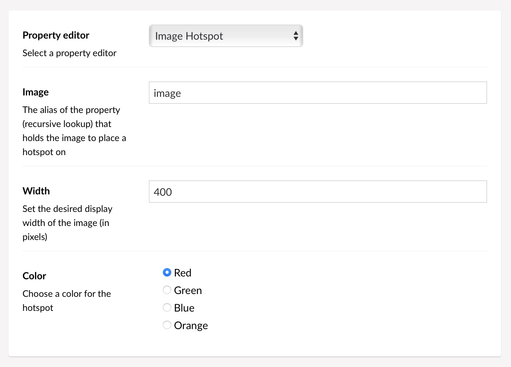

# Image Hotspot for Umbraco



This property editor provides similar functionality to what was previously available with the [uComponents ImagePoint](http://ucomponents.github.io/data-types/image-point/) data type in Umbraco, versions 4 and 6.

(This one's just called “Image Hotspot” because that's what our clients call it when they ask for this kind of thing 😁)

It's a property editor that displays an image and lets the editor place a hotspot on it.

## Screenshots

### Property editor:



*Property editor with insets showing the alternate colors*

***

The configuration looks like this:

### Configuration:



*DataType Configuration*

The property editor looks for the **Image** by looking up the alias recursively,
so it's possible to use it on a doctype that's used by **Nested Content** or **Block List**.

***

### Property Data

The raw JSON data looks like this:

```json
{
	"image": "/media/1492/what-a-nice-picture.jpg",
	"left": 223,
	"top": 307,
	"percentX": 55.75,
	"percentY": 74.878048780487804878,
	"width": 400,
	"height": 410
}
```

The hotspot coordinate is saved both as exact pixel values and as percentage
values, along with the image's path, width & height.

The included **PropertyConverter** enables ModelsBuilder to do its magic and provide you with
an `ImageHotspot` object instead of the JSON data:

```csharp
public class ImageHotspot {
	public string Image { get; set; }
	public int Left { get; set; }
	public int Top { get; set; }
	public decimal PercentX { get; set; }
	public decimal PercentY { get; set; }
	public int Width { get; set; }
	public int Height { get; set; }
}
```

The `.ToString()` method has been crafted to be used inside a style attribute, to give you the
hotspot's position in one go - something like `left: 10.3%; top: 24.3333%`, e.g.:

```razor
var marker = Model.Hotspot;

<div style="position:relative; display:inline-flex;">
	
	<span
		style="
			position:absolute;
			background:#f80c;
			transform:translate(-50%,-50%);
			border-radius:5px;
			width:10px;
			height:10px;
			@(marker)
		"></span>
</div>
```
